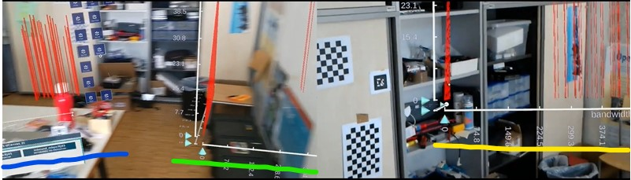
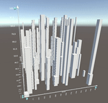
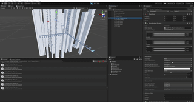

# IATK 1.0 (Mala): Immersive Analytics Toolkit
 **IATK: Immersive Analytics Toolkit** is a Unity project to help you build **high quality**, **interactive** and **scalable** **data visualisations** in **Immersive Environments (Virtual/Augmented Reality)**. Use the *Visualisation* script to create data visualisations interactively in the editor, press play and view and interact with your data in V/AR. Write simple code to use the *IATK* core graphics components to make your own interactive visualisations programitcally.
<!-- With IATK, load CSV/TSV files and write simple code using the library to create immersive data visualisations.
%IATK provides a *Visualisation* script to help you create and design visualizations within the Unity editor -->
IATK is an ongoing and open project! We setup a roadmap with features that we would like to see in IATK in a near future.  
<br/>
<br/>

## Publication

IATK was published at IEEE VR 2019 - Please use following reference:

@inproceedings{cordeil2019iatk,
  title={IATK: An Immersive Analytics Toolkit},
  author={Cordeil, Maxime and Cunningham, Andrew and Bach, Benjamin and Hurter, Christophe and Thomas, Bruce H and Marriott, Kim and Dwyer, Tim},
  booktitle={2019 IEEE Conference on Virtual Reality and 3D User Interfaces (VR)},
  pages={200--209},
  year={2019},
  organization={IEEE}
}

# Dependencies
IATK requires the [MapBox Unity Plugin](https://www.mapbox.com/)

## Tutorial
A video tutorial of IATK [can be found here](https://vimeo.com/320646218)
The actual tutorial starts at 01:12
<!--[the slides of our tutorial are available here](https://drive.google.com/open?id=1-uBezockeTltw1x-5gcNsQrAPJ9v08up) -->

<!-- -- We will give an Immersive Visualisation tutorial with IATK at IEEE VIS 2018. -->
Required downloads:

- this repository
- [Unity 2018](https://unity3d.com/get-unity/)
- [Virtual reality toolkit VRTK](https://github.com/thestonefox/VRTK)

***!!! IATK works on Windows machines -  Mac users please [install bootcamp](https://support.apple.com/en-au/HT201468) !!!***

Setup a VR scene with the Oculus Rift in Unity: https://www.youtube.com/watch?v=psPVNddjgGw&t

Setup a VR scene with the HTC Vive in Unity: https://www.youtube.com/watch?v=tyFV9oBReqg&list=RDtyFV9oBReqg&start_radio=1

Our repository contains sample datasets. Come with your CSV data to the tutorial if you want to give it a go!

## IATK editor components
### Data Source: import data into the scene
First, create a **Data Source** object (right click in the hierarchy, IATK/DataSouce). Drag and drop a CSV/TSV in the *Data field*. Your data is now imported into the Unity scene!

### Visualisation: an editor menu helper
IATK has a number of predefined, controlable data visualisation templates that are accessible directly in the editor. The **Visualisation** object allows you to access those templates.

Create a **Visualisation** object (right click in the hierarchy, IATK/Visualisation). Drag and drop a **Data Source** object in the *Data Source* field of the Visualisation object. You are now ready to design a data visualisation with the following templates:

- Simple visualisation:
  * 2D/3D scatterplots

  

  * 2D/3D barcharts

  

  * 2D/3D trails/trajectories (use linkning field to bind a *linking attribute*)

    

  * 2D/3D Connnected dots (use linking field to bind a *linking attribute*)

   

- Parallel Coordinates Plots (PCPs):


- Scatterplot Matrix
  - 2D Scatterplot Matrix

  

  - 3D Scatterplot Matrix

    

### Visualisation designer in the Unity Editor

<!--<p align="center">
</p> -->

  The visualisation component allows the design of the visualisation inside the Unity Editor. Visual variables can be attached to data dimension attributes.

- Geometry: defines the geometry of the visualisation. **Points, Quads, Bars** and **Cubes** are a single point topology. **Lines and Connected Lines and Dots** are a line topology and they require you to specify a *Linking dimension* (see below)
- Colour dimension: use the dropdown to bind a data attribute to a continuous colour gradient. Click the Colour gradient to edit it.
- Bind Colour palette: use the dropdown to bind a discrete data attribute to a discrete colour palette. Click the corresponding colour values to edit the palette.
- Blending Mode Source, Destination: lets you specify the blending mode. By default it's set to SrcAlpha,OneMinusSrcAlpha that allows for traditional blending with transparency. Use One,One to do visual accumation effects.
- Colour: if *Colour dimension* and *Bind Coolour palette* are *Undefined*, sets the same colour to all the glyphs.
- Size dimension: use the dropdown to bind an attribute to the size of the glyphs. The Size slider sets the global size, the Min/Max Size slider sets the scale.
- Linking dimension: use the dropdown to link datapoints by id. **/!\ It requires that your data is ordered in sequence in the CSV source**
- Attribute Filters: type in an attribute name and use filters to filter ranges of values. This is an additional visual query facility.

### Linked Visualisations

 

Create visual links between two visualisations (right click IATK>LinkedVisualisation). Drag and drop two visualisations objects (source,target) into the *Linked Visualisation* component. Set the ShowLinks (true/false) variable to show/hide the links between the 2 visualisations.

### Brushing and Linking
 It is easy to setup brushing and linking visualisations with IATK. First create a *BrushingAndLinking* object (right click in hierarchy, IATK>Brushing And Linking).
You now have to drag and drop a *Visualisation* object that will act as the brush controller: the Brushing Visualisation. Then drag and drop how many visualisations you wish to link to this brushing visualisation in the Brushed Visualisations list. You can also attach a *Linked Visualisation* object to show highlights of the brushed data. The visual elements brushed (by attaching *Transforms* into Input1 and Input2) in the Brushing Visualisation will be highlighted in the Brushed Visualisations and the Brushed Linked Visualisations.

<!--Define a Brushing visualisation and a list of Brushed visualisation. Define the input shape and the color of the brush. -->

<!--## IATK VR interaction ##
Use VRTK to interact with the data visualisations. -->

## IATK core data and graphics scripting
### DataSource
The DataSource object is the starting point of your immersive data visualisation project. It allows you to import your text data into Unity and has a set of methods to access the data by attribute, id etc.

Usage:
```csharp
//Use Unity Test assets to import text data (e.g. csv, tsv etc.)
TextAsset myDataSource;
CSVDataSource myCSVDataSource;
myCSVDataSource = createCSVDataSource(myDataSource.text);

// a reusable method to create an IATK CSVDataSource object.
CSVDataSource createCSVDataSource(string data)
{
CSVDataSource dataSource;
dataSource = gameObject.AddComponent<CSVDataSource>();
dataSource.load(data, null);
return dataSource;
}

```
Further details (methods, properties) are available in the documention [to come].

### ViewBuilder
IATK uses a fluent design pattern that lets you chain commands to design a visualisation in a single instruction.
Example in the **Scripting** section

### View
Once you have built a View object with the Viewbuilder, you can change the view attributes (colours, positions, sizes, filters ...) . See documentation [to come].

### Graphics toolkit
The toolkit contains facilities to create high quality graphics dsigned for data visualisation in Virtual and Augmented Reality. The IATK core graphics tools include:

- a **BigMesh** script that allows the creation of visualisations
- several **shaders** to render a lot of data rapidly and efficiently, and custom graphics for data visualisations (thick lines, dots/spheres, cubes/bars)
- a selection tool (brushing) that enables the selection of data accross several data visualizations.

### Scripting
Example of building a visualisation from code. The *ViewBuilder* class allows the design of the visualisation. When *applying* (i.e. using the .apply(GameObject go, Material) method) the ViewBuilder returns a View. The View object can then be later updated (e.g. set positions, colors, etc...).

```csharp
// create a view builder with the point topology
ViewBuilder vb = new ViewBuilder (MeshTopology.Points, "Uber pick up point visualisation").
                     initialiseDataView(csvds.DataCount).
                     setDataDimension(csvds["Lat"].Data, ViewBuilder.VIEW_DIMENSION.X).
                     setDataDimension(csvds["Base"].Data, ViewBuilder.VIEW_DIMENSION.Y).
                     setDataDimension(csvds["Lon"].Data, ViewBuilder.VIEW_DIMENSION.Z).
                     setSize(csvds["Base"].Data).
                     setColors(csvds["Time"].Data.Select(x => g.Evaluate(x)).ToArray());

// use the IATKUtil class to get the corresponding Material mt
Material mt = IATKUtil.GetMaterialFromTopology(AbstractVisualisation.GeometryType.Points);
mt.SetFloat("_MinSize", 0.01f);
mt.SetFloat("_MaxSize", 0.05f);

// create a view builder with the point topology
View view = vb.updateView().apply(gameObject, mt);
```
## IATK Replicator
The `Replicator` adds functionality to replicate a visualization either within the same application or to any other target. Depending on the distribution channel uni- and bidirectional connections are realizeable in either *1:1*, *1:n* or *m:n* setups. The core of the replication functionality is the `Replicator` class, which enables to produce and consume replications.


Here we see to users using a Hololens each and consuming visualizations. The left one is in control of the replicas, whereas the right one receives the updates. ***Blue*** showns the prime visualization with its controls (MRTK). ***Green*** shows a local replica which behaves the same as remote replicas do. ***Yellow*** shows a replica consume by different user running on a different device running a different application with an active `Replicator`.

### Initialization
The `Replicator` class has to be added to a GameObject and its hooks have to be setup.

### Callback hooks
To enable replication for visualizations, we have to propagate functions hooks which are then internally passed on to the visualization.

  - `Publish` is called whenever a vis is called with `string id` and `string payload`. It should implement the distribtution method e.g. send over network.
  - `PublishDatasource` is called whenever a datasource is changed or updated (e.g. dimension is added) with `string id` and `string payload`. It should implement the distribtution method e.g. send over network.
  - `GetStreamData` is called when new data is received over the distribution channel (e.g. network). The first parameter takes the `string id` and the second is the internal data-parsing function of the replicator which can either be directly executed or passed on as callback.
  - `NewVisSpawnNotification` is called whenever a replica is spawned with the parameter `string gameObjectName`.


```csharp
public Func<string, string, string> Publish = null;
public Func<string, string, string> PublishDatasource = null;
public Func<string, Func<string, string, string>, string> GetStreamData = null;
public Func<string, string> NewVisSpawnNotification = null;
```
For a closer look please check `Replicator.cs` and `ReplicatorTest.cs`.

***Hook implementation examples from `ReplicatorTest.cs`:***
```csharp
public string PublishImple(string id, string payload)
{
    string topic = "rr/vis/replication/" + id + "/view";
    Vizario.MQTTManager.Publish(topic, payload);
    return topic;
}
```
```csharp
public string PublishDatasourceImple(string id, string payload)
{
    string topic = "rr/vis/replication/" + id + "/ds";
    Vizario.MQTTManager.Publish(topic, payload);
    return topic;
}
```
```csharp
public string GetStreamData(string uri, Func<string, string, string> OnNewData)
{
    Vizario.MQTTManager.Subscribe(uri);
    Vizario.MQTTManager.RegisterCallbackTopicCs(OnNewData, uri);
    return "";
}
```
```csharp
public string GetStreamData(string uri, Func<string, string, string> OnNewData)
{
    Vizario.MQTTManager.Subscribe(uri);
    Vizario.MQTTManager.RegisterCallbackTopicCs(OnNewData, uri);
    return "";
}
```
```csharp
public string SpawnNot(string goName) {
    var go = GameObject.Find(goName);
    go.transform.parent = Camera.main.transform;        
    return "";
}
```

### Replicating a visualizations
If everything is setup, a visualization can be replicated by adding it to the replicator. Once done, it is published over the distribution channel and consumed on any other `Replicator` connected to the channel (it can also be the same Replicator to create a synced copy of vis within the same application). This will sync the vis but not its data, which allows to perform style transfer, but the use with independent data. On the other hand, we can also sync Datasource with its dimensions by adding it with its visualization id to the replicator. (***NOTE: currently this only works for RealtimeDataSources with streaming data from external sources, where only the address of the streaming source has to be shared***)

***Adding a visualization example:***
```csharp
public void StartReplication()
{
    if (vis == null)
    {
        return;
    }

    if (vis.uid.Length > 0 && repl != null)
    {
        repl.AddVisToReplicate(vis.uid, vis, false);
        repl.AddDataSourceDef(vis.uid, "telemetry/inffeld16/2nd/id2068/littleserver/RJ45/#", "", "bandwidth_Mbps");
        repl.AddDataSourceDef(vis.uid, "telemetry/inffeld16/2nd/id2068/bigserver/RJ45/#", "", "inbound_Mbps");
    }
}
```

***Receiving and consuming replication:***
```csharp
public void ListenForReplicationUpdates()
{
    string t = "rr/vis/replication/#";
    Vizario.MQTTManager.Subscribe(t);
    Vizario.MQTTManager.RegisterCallbackTopicCs(
        (string topic, string payload) =>
        {
            Debug.Log("ListenForReplicationUpdates => topic:" + topic + ", payload:" + payload);

            string uid = null;
            var parts = topic.Split('/');
            var plType = parts[parts.Length - 1];

            if (parts.Length > 1)
            {
                uid = parts[parts.Length - 2];
            }

            Debug.Log("ListenForReplicationUpdates plType=" + plType + ", uid=" + uid);

            if (plType == "view" && uid != null && uid.Length > 0)
            {
                //create vis replication from payload
                Debug.Log("ListenForReplicationUpdates updating replicas ...");
                repl.UpdateReplicas(uid, payload);
            }

            if (plType == "ds" && uid != null && uid.Length > 0)
            {
                //create datasource from payload connected to a vis
                Debug.Log("ListenForReplicationUpdates updating replicas ...");
                repl.UpdateDatasource(uid, payload);
            }
            return topic;
        }, t);
}
```

### Open tasks and issues
- add support for other data datasources (e.g. `CSVDatasource`)
- buggy bidirectional sync might cause and change-apply update loop
- `Replicator::SyncVis` might have some bug when applying change vis parameters to a replica.
- Snyc of location information e.g. placement at the same postion when colocated.

## Known issues
IATK is a prototype for research and there are known issues that we will fix in the near future.

- unrecognised symbols in data source can break the scripts
- scatterplot matrices can be slow due to the amount of points to display (if you have a very large dataset and a lot of dimension, scatetrplot matrices will be slow)

## Roadmap
In a near feature we will support:

- fix number of labels for discrete values (delegate method)
- details on demand
- 2D/3D graph visualisation (node-link diagrams) directly in the *Visualisation* editor
- more type of data sources (~~including real time data~~)
- more geometry (e.g. surfaces / volumes)

### IATK RealtimeDataSource




## Team
The toolkit is developed by Maxime Cordeil (project leader, Monash University), Andrew Cunningham (University of South Australia) and Benjamin Lee (Monash University).

Past developpers: Kingsley Stephens (Monash University).
